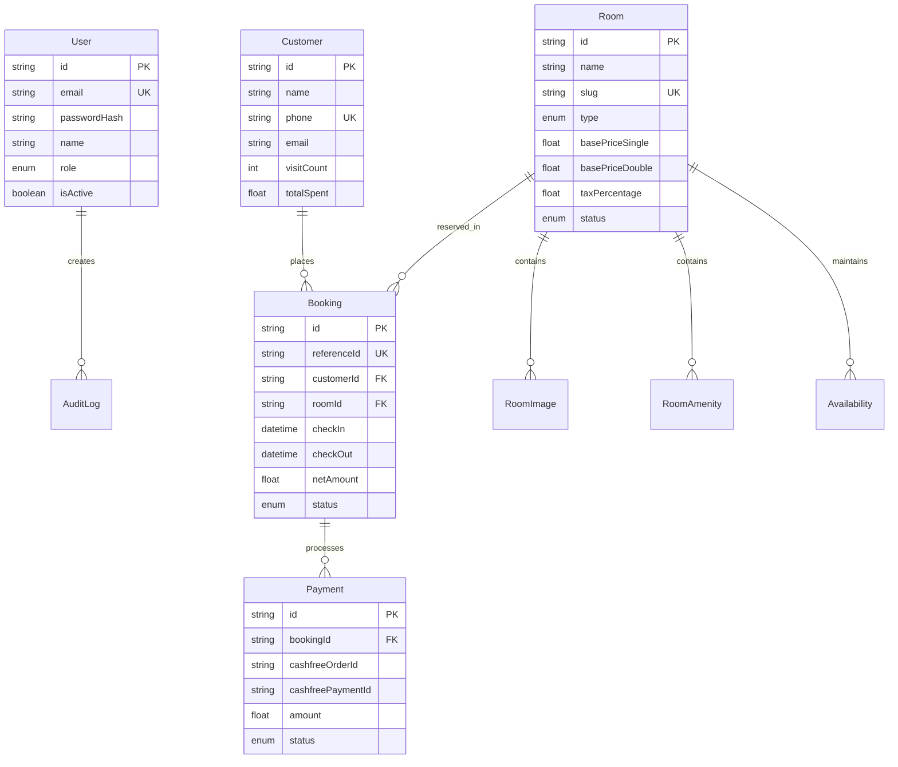
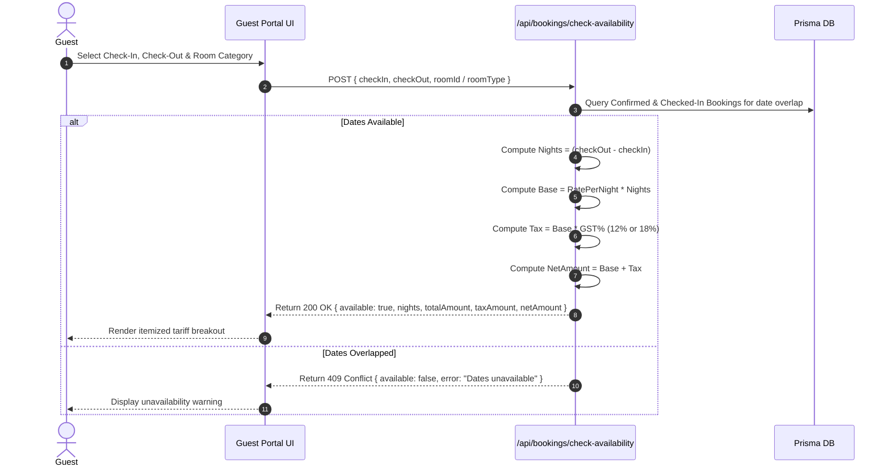
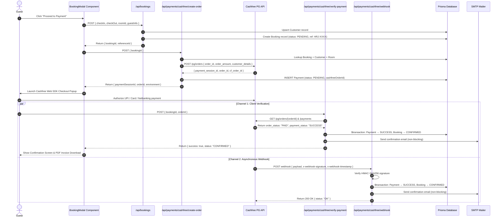

# Hotel Rajhans International — System Architecture & Complete Workflow

> **Property**: Hotel Rajhans International (MG Road, Kachari Chowk, Bhagalpur, Bihar – 812001)  
> **System**: Full-Stack Hotel Management System (HMS) & Guest Web Portal  
> **Version**: 0.1.1 (Next.js 16 + Prisma ORM + Cashfree PG)

---

## Table of Contents

1. [Executive Summary](#1-executive-summary)
2. [Technology Stack](#2-technology-stack)
3. [System Architecture](#3-system-architecture)
4. [Database Schema & ERD](#4-database-schema--erd)
5. [End-to-End Workflows](#5-end-to-end-workflows)
   - [5.1 Guest Room Browsing & Tariff Calculation](#51-guest-room-browsing--tariff-calculation)
   - [5.2 Guest Reservation & Cashfree Payment Workflow](#52-guest-reservation--cashfree-payment-workflow)
   - [5.3 Admin Authentication & RBAC Security](#53-admin-authentication--rbac-security)
   - [5.4 Admin Operations & Management](#54-admin-operations--management)
6. [API Route Specifications](#6-api-route-specifications)
7. [Business, Security & Tax Logic](#7-business-security--tax-logic)
8. [Project Directory Map](#8-project-directory-map)

---

## 1. Executive Summary

**Hotel Rajhans International** is a luxury hospitality property in Bhagalpur, Bihar. The system consists of two primary portals:

1. **Guest Web Portal (`/`)**: A luxury storefront allowing guests to explore rooms, check real-time availability, compute dynamic tariffs with GST, reserve rooms, complete online payments via Cashfree Payment Gateway (UPI, Cards, Netbanking), and generate automated tax invoices.
2. **Admin Control Panel (`/admin/*`)**: A secure administrative interface for hotel management to monitor revenue & occupancy, adjust room pricing, manage reservations, view guest CRM profiles, update CMS policies, and export financial analytics (XLSX, CSV, PDF).

---

## 2. Technology Stack

| Layer | Technology | Details |
| :--- | :--- | :--- |
| **Framework** | **Next.js 16 (App Router)** | Full-stack React framework with Server & Client Components |
| **UI Library** | **React 19** | Component-driven architecture |
| **Styling** | **Tailwind CSS v4** | Custom luxury color tokens (gold `#D4AF37`, slate, amber) |
| **Animations** | **Framer Motion** | Smooth UI transitions, modals, and interactive pulses |
| **Icons** | **Lucide React** | Accessible vector icon set |
| **Database & ORM** | **Prisma ORM (v6.4)** | Type-safe query engine |
| **Database Engines** | **SQLite (dev) / PostgreSQL (prod)** | Relational persistence |
| **Authentication** | **JOSE (JWT) + Bcrypt** | Stateless JWT tokens stored in `httpOnly` cookies |
| **Payment Gateway** | **Cashfree PG SDK (v2023-08-01)** | Serverless payment sessions (UPI, Cards, Netbanking, Webhooks) |
| **Email Service** | **Nodemailer (SMTP)** | Automated booking invoice dispatch |
| **Reporting & Exports**| **jsPDF, html2canvas, xlsx, json2csv** | Tax invoice PDFs & financial spreadsheet exports |
| **Integrations** | **Google Sheets API** | Synchronized cloud backup for confirmed reservations |

---

## 3. System Architecture

```mermaid
graph TD
    subgraph Client Layer
        A[Guest Web Portal /] -->|Book Room / View Tariffs| B[BookingModal Component]
        A -->|Explore Attractions / Location| C[Attractions & Map Section]
        D[Admin Control Panel /admin/*] -->|Manage Operations| E[Admin Dashboard & Controls]
    end

    subgraph Middleware & Security
        F[Next.js Middleware - middleware.ts] -->|Verify JWT Cookie| G{Authenticated?}
        G -->|Yes| D
        G -->|No| H[Redirect /admin/login]
    end

    subgraph Serverless API Router
        B -->|POST /api/bookings| I[Bookings API]
        B -->|POST /api/payments/cashfree/*| J[Cashfree Payment API]
        E -->|GET /api/reports| K[Reports Aggregator API]
        E -->|PUT /api/rooms/[id]| L[Room Management API]
        E -->|GET /api/customers| M[Customer CRM API]
    end

    subgraph External Integrations & Storage
        I -->|Query & Write| N[(Prisma Database)]
        J -->|Order Creation & Verification| O[Cashfree PG Gateway API]
        J -->|Send Confirmation Invoice| P[SMTP Mail Server]
        J -->|Sync Confirmed Reservation| Q[Google Sheets API]
        K & L & M -->|Query & Persist| N
    end
```

---

## 4. Database Schema & ERD

The system maintains 14 relational data models in Prisma ORM:



### Complete Model Summary

| Model | Primary Key | Key Fields | Description |
| :--- | :--- | :--- | :--- |
| `User` | `id` (UUID) | `email`, `passwordHash`, `name`, `role`, `isActive` | Operational staff & admin users |
| `Room` | `id` (UUID) | `name`, `slug`, `type`, `basePriceSingle`, `basePriceDouble`, `status` | Suite inventory & tariff parameters |
| `RoomImage` | `id` (UUID) | `roomId`, `url`, `alt`, `isPrimary`, `displayOrder` | Suite photography gallery |
| `RoomAmenity` | `id` (UUID) | `roomId`, `amenityName` | Room amenities (AC, Smart TV, WiFi) |
| `Availability`| `id` (UUID) | `roomId`, `date`, `status`, `reason` | Date-specific inventory blockages |
| `Customer` | `id` (UUID) | `name`, `phone`, `email`, `visitCount`, `totalSpent` | Guest CRM profiles |
| `Booking` | `id` (UUID) | `referenceId`, `customerId`, `roomId`, `checkIn`, `checkOut`, `status` | Master reservation entries |
| `Payment` | `id` (UUID) | `bookingId`, `cashfreeOrderId`, `cashfreePaymentId`, `amount`, `status` | Payment audit logs |
| `GalleryImage`| `id` (UUID) | `url`, `alt`, `category`, `size`, `displayOrder` | Property media gallery |
| `ContactMessage`|`id` (UUID)| `name`, `email`, `phone`, `message`, `status`, `replyText` | Contact form inquiries |
| `Review` | `id` (UUID) | `authorName`, `rating`, `reviewText`, `source`, `status` | Guest testimonials |
| `FAQ` | `id` (UUID) | `question`, `answer`, `displayOrder`, `isActive` | Frequently asked questions |
| `Setting` | `id` (UUID) | `key`, `value`, `category`, `description` | Key-value system parameters |
| `AuditLog` | `id` (UUID) | `userId`, `userName`, `action`, `entity`, `details` | Security audit trail |

---

## 5. End-to-End Workflows

### 5.1 Guest Room Browsing & Tariff Calculation



---

### 5.2 Guest Reservation & Cashfree Payment Workflow



---

### 5.3 Admin Authentication & RBAC Security

1. **Login Request**: Admin submits email & password at `/admin/login`.
2. **Password Verification**: API (`POST /api/auth/login`) verifies hash via `bcrypt.compare()`.
3. **Session Token**: Generates a stateless JWT using `jose` (`HS256`).
4. **Cookie Security**: Sets `admin_token` cookie with `httpOnly: true`, `sameSite: lax`, `path: /`.
5. **Route Protection**: `src/middleware.ts` intercepts all `/admin/*` requests, verifies JWT token validity, and redirects unauthenticated users to `/admin/login`.

---

### 5.4 Admin Operations & Management

- **Dashboard (`/admin/dashboard`)**: Monitors KPI metrics (total revenue, occupancy %, active bookings, pending reviews).
- **Rooms Management (`/admin/rooms`)**: Controls room rates (`basePriceSingle`, `basePriceDouble`), status (`AVAILABLE`, `MAINTENANCE`), and extra bed pricing.
- **Bookings Desk (`/admin/bookings`)**: Views, filters, and updates reservation statuses (`CONFIRMED`, `CHECKED_IN`, `CHECKED_OUT`, `CANCELLED`).
- **Guest CRM (`/admin/customers`)**: Manages guest history, visit counts, total spent, VIP badges, and custom notes.
- **Payment Audit (`/admin/payments`)**: Displays Cashfree transaction logs, payment IDs, amounts, and gateway responses.
- **Financial Reports (`/admin/reports`)**: Aggregates revenue analytics with single-click exports to CSV, XLSX, or PDF formats.

---

## 6. API Route Specifications

| Method | Route Endpoint | Auth Required | Purpose |
| :--- | :--- | :---: | :--- |
| `POST` | `/api/auth/login` | No | Authenticates admin credentials and sets JWT session cookie |
| `POST` | `/api/auth/logout` | Yes | Clears admin JWT session cookie |
| `GET` | `/api/auth/me` | Yes | Returns current authenticated admin user profile |
| `GET` | `/api/rooms` | No | Fetches active room inventory with images and amenities |
| `POST` | `/api/rooms` | Admin | Creates a new room category |
| `PUT` | `/api/rooms/[id]` | Admin | Updates room prices, details, or maintenance status |
| `GET` | `/api/bookings` | Admin | Lists reservations with status filtering & search query |
| `POST` | `/api/bookings` | No | Checks date availability and creates pending reservation (`HRJ-XXXX`) |
| `POST` | `/api/bookings/check-availability` | No | Computes dynamic night tariffs, GST taxation, and date overlaps |
| `PUT` | `/api/bookings/[id]` | Admin | Updates booking status (Check-In, Check-Out, Cancel) |
| `POST` | `/api/payments/cashfree/create-order` | No | Generates Cashfree PG order and returns `payment_session_id` |
| `POST` | `/api/payments/cashfree/verify-payment` | No | Verifies payment status server-side and confirms reservation |
| `POST` | `/api/payments/cashfree/webhook` | Webhook Sig | Webhook endpoint for asynchronous payment confirmation |
| `GET` | `/api/customers` | Admin | Fetches guest CRM records |
| `PUT` | `/api/customers` | Admin | Updates guest VIP status, notes, or address details |
| `GET` | `/api/reports` | Admin | Aggregates revenue, occupancy, and monthly metrics |
| `GET` | `/api/cms` | No | Fetches global settings, FAQs, and approved reviews |
| `PUT` | `/api/cms` | Super Admin | Updates global hotel policies, GSTIN, and CMS settings |
| `GET` | `/api/invoice/[id]` | Public | Renders HTML tax invoice for a given booking reference |
| `GET` | `/api/location/distance` | No | Calculates distance and travel time from Bhagalpur Junction |

---

## 7. Business, Security & Tax Logic

1. **GST Taxation Rules**:
   - Executive / Deluxe Rooms & Dormitory: **12% GST**
   - Royal Suite: **18% GST**
2. **Idempotent Payment Handling**:
   - Verification routes check `booking.status === "CONFIRMED"` before processing.
   - Prevents duplicate database transactions, duplicate emails, and duplicate Google Sheets rows.
3. **Atomic Database Transactions**:
   - Payment confirmation uses `prisma.$transaction()` to ensure `Payment` status and `Booking` status update together atomically.
4. **Non-Blocking Post-Payment Services**:
   - Email dispatch (SMTP) and Google Sheets synchronization run as non-blocking tasks so gateway verification responses are never delayed or failed by external API timeouts.

---

## 8. Project Directory Map

```
Rajhans/
├── cashfree_workflow.md              # Cashfree PG Integration Architecture Doc
├── arch.md                           # Master Architecture & Complete Workflow (This Document)
├── prisma/
│   ├── schema.prisma                 # Prisma Database Schema Definitions
│   ├── seed.ts                       # Database Seeding Script (Admin & Default Rooms)
│   └── dev.db                        # SQLite Development Database
├── public/
│   └── images/                       # Property Media (Attractions, Rooms, Reception, Restaurant)
├── src/
│   ├── app/
│   │   ├── admin/                    # Admin Portal Pages (Dashboard, Bookings, Rooms, Payments, CMS)
│   │   ├── api/                      # Next.js Serverless API Route Handlers
│   │   │   ├── auth/                 # Login, Logout, Me Handlers
│   │   │   ├── bookings/             # Reservation Handlers
│   │   │   ├── payments/cashfree/    # Cashfree PG Handlers (create-order, verify-payment, webhook)
│   │   │   ├── cms/                  # Settings, FAQs, Reviews Handlers
│   │   │   ├── customers/            # CRM Handlers
│   │   │   ├── invoice/              # Invoice HTML Renderer
│   │   │   ├── reports/              # Revenue & Analytics Aggregator
│   │   │   └── rooms/                # Room Inventory Handlers
│   │   ├── layout.tsx                # Root App Layout & Font Providers
│   │   └── page.tsx                  # Guest Web Portal Storefront
│   ├── components/                   # Reusable React UI Components
│   │   ├── BookingModal.tsx          # Booking & Cashfree Web SDK Checkout Modal
│   │   ├── AttractionsSection.tsx    # Bhagalpur Excursions Showcase Component
│   │   ├── ImageGallery.tsx          # Lightbox Media Gallery
│   │   └── LocationSection.tsx       # Google Maps & Connectivity Component
│   ├── lib/                          # Core Helper Libraries
│   │   ├── auth.ts                   # JWT & Password Encryption Helper
│   │   ├── cashfree.ts               # Core Cashfree API Library & Signature Verifier
│   │   ├── googlesheets.ts           # Google Sheets Backup Sync Helper
│   │   ├── invoice.ts                # Tax Invoice HTML Generator
│   │   ├── mailer.ts                 # SMTP Nodemailer Dispatch Helper
│   │   ├── prisma.ts                 # Prisma Client Singleton Setup
│   │   └── utils.ts                  # Tariff Math & Date Overlap Helpers
│   ├── middleware.ts                 # Admin Route Protection Guard
│   └── types/                        # TypeScript Interfaces & Declarations
├── package.json                      # Project Dependencies & Scripts
└── next.config.ts                    # Next.js App Router Config
```

---

*Documented for Hotel Rajhans International — August 2026*
