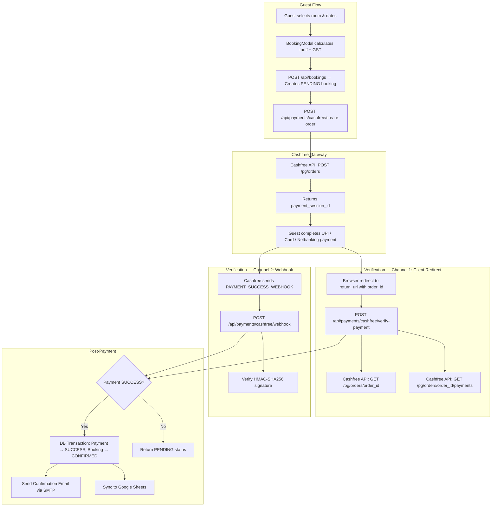
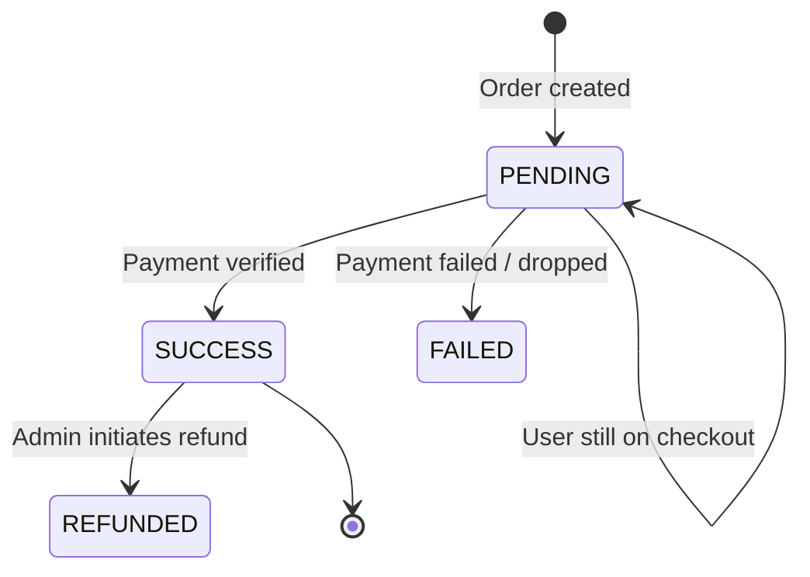
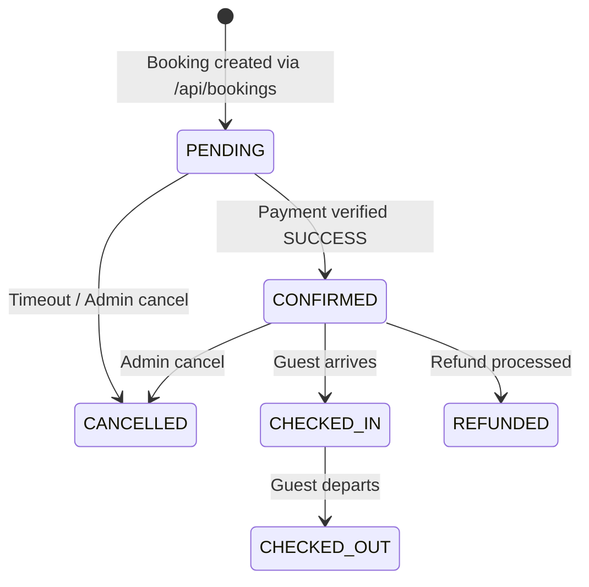
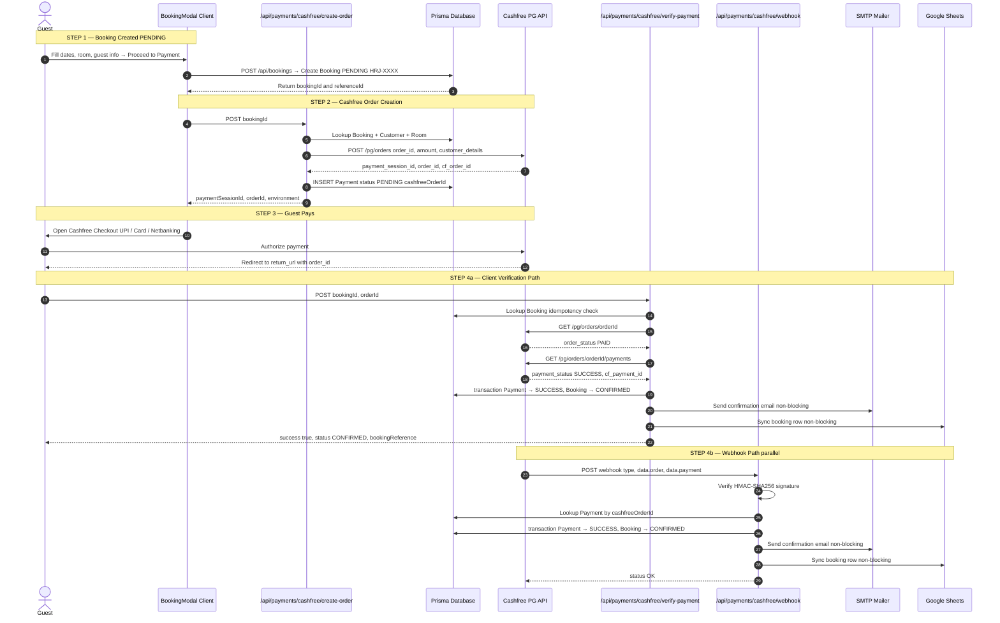

# Cashfree Payment Gateway — Complete Workflow

> **Hotel Rajhans International**
> Cashfree PG Integration Architecture & Payment Lifecycle Documentation

---

## Table of Contents

1. [Architecture Overview](#1-architecture-overview)
2. [Environment Configuration](#2-environment-configuration)
3. [Database Schema](#3-database-schema)
4. [File Map](#4-file-map)
5. [Payment Lifecycle — Step by Step](#5-payment-lifecycle--step-by-step)
6. [API Specifications](#6-api-specifications)
7. [Webhook Processing](#7-webhook-processing)
8. [Post-Payment Actions](#8-post-payment-actions)
9. [Security & Safety Mechanisms](#9-security--safety-mechanisms)
10. [Local Development Simulation](#10-local-development-simulation)

---

## 1. Architecture Overview

The Cashfree integration follows a **2-channel verification** model for maximum reliability:



### Why 2 Verification Channels?

| Channel | Trigger | Purpose |
|---|---|---|
| **Client Verify** (`verify-payment`) | Browser redirect after payment | Instant UI confirmation for the guest |
| **Webhook** (`webhook`) | Cashfree server-to-server POST | Guaranteed delivery even if browser closes mid-payment |

Both channels are **idempotent** — if the booking is already `CONFIRMED`, subsequent calls return early without duplicate processing.

---

## 2. Environment Configuration

### Required Variables

```env
# Cashfree PG Credentials
CASHFREE_CLIENT_ID="TESTxxxxxxxxxxxxxxxxxxxxxxxx"       # or CASHFREE_APP_ID (backward-compatible)
CASHFREE_CLIENT_SECRET="cfsk_ma_xxxxxxxxxxxxxxxxxxxxxxxx"  # or CASHFREE_SECRET_KEY (backward-compatible)

# Environment Mode
CASHFREE_ENV="SANDBOX"          # "SANDBOX" for testing, "PRODUCTION" for live payments

# API Version (optional, defaults to 2023-08-01)
CASHFREE_API_VERSION="2023-08-01"

# Application URL (used for return_url after payment)
NEXT_PUBLIC_APP_URL="https://hotelrajhansinternational.com"
```

### Environment Auto-Detection Logic

```
if CASHFREE_ENV is explicitly "PRODUCTION" or "SANDBOX" → use it
else if CASHFREE_CLIENT_ID starts with "TEST" → SANDBOX
else → PRODUCTION
```

### API Base URLs

| Environment | Base URL |
|---|---|
| **SANDBOX** | `https://sandbox.cashfree.com/pg` |
| **PRODUCTION** | `https://api.cashfree.com/pg` |

---

## 3. Database Schema

### Payment Model (Prisma)

```prisma
model Payment {
  id                String        @id @default(uuid())
  bookingId         String
  cashfreeOrderId   String?       // Cashfree order_id (e.g. cf_HRJ-20260825-0001_1724523000000)
  cashfreePaymentId String?       // Cashfree cf_payment_id (populated after verification)
  amount            Float
  currency          String        @default("INR")
  method            PaymentMethod @default(UPI)
  status            PaymentStatus @default(PENDING)   // PENDING → SUCCESS or FAILED
  gatewayResponse   String?       // Full JSON response from Cashfree API
  createdAt         DateTime      @default(now())
  booking           Booking       @relation(fields: [bookingId], references: [id], onDelete: Cascade)
}
```

### Payment Status Lifecycle



### Booking Status Lifecycle



---

## 4. File Map

```
src/
├── lib/
│   └── cashfree.ts                          # Core Cashfree library
│       ├── createCashfreeOrder()             #   → POST /pg/orders
│       ├── fetchCashfreeOrderPayments()      #   → GET /pg/orders/{id} + /payments
│       ├── verifyCashfreeWebhookSignature()  #   → HMAC-SHA256 verification
│       ├── isCashfreeConfigured()            #   → Credential check
│       ├── canUseCashfreeSimulation()        #   → Local dev fallback check
│       └── getCashfreeEnvironment()          #   → Returns SANDBOX / PRODUCTION
│
├── app/api/payments/cashfree/
│   ├── create-order/route.ts                # Step 1: Create Cashfree order
│   ├── verify-payment/route.ts              # Step 2a: Client-side payment verification
│   └── webhook/route.ts                     # Step 2b: Server-to-server webhook handler
│
├── lib/mailer.ts                            # SMTP email delivery (Nodemailer)
├── lib/invoice.ts                           # HTML email template generation
└── lib/googlesheets.ts                      # Google Sheets booking sync
```

---

## 5. Payment Lifecycle — Step by Step

### Complete Sequence Diagram



---

### Step-by-Step Breakdown

### Step 1: Booking Creation

The guest fills in check-in/out dates, room selection, and personal details in the `BookingModal`. The frontend calls `POST /api/bookings` which:

1. Validates date availability (no overlapping bookings)
2. Creates or updates the `Customer` record
3. Creates a `Booking` record with status `PENDING` and a unique reference ID (e.g., `HRJ-20260825-0001`)
4. Returns the `bookingId` to the client

---

### Step 2: Cashfree Order Creation

**Route**: `POST /api/payments/cashfree/create-order`

**Input**: `{ bookingId: string }`

**Process**:
1. Lookup booking with customer and room details from database
2. Generate a unique Cashfree order ID: `cf_{referenceId}_{timestamp}`
3. Call `createCashfreeOrder()` which sends:
   ```
   POST https://api.cashfree.com/pg/orders
   Headers: x-client-id, x-client-secret, x-api-version
   Body: { order_id, order_amount, order_currency, customer_details, order_meta }
   ```
4. Store a `Payment` record in the database with `status: PENDING`
5. Return `payment_session_id` to the client for Cashfree SDK checkout

**Output**:
```json
{
  "success": true,
  "paymentSessionId": "session_xxxxxxxxx",
  "orderId": "cf_HRJ-20260825-0001_1724523000000",
  "bookingReference": "HRJ-20260825-0001",
  "environment": "PRODUCTION"
}
```

---

### Step 3: Guest Payment

The client uses the `payment_session_id` to open the Cashfree checkout UI (Drop-in or Redirect). The guest completes payment via UPI, Card, or Netbanking. After payment, the browser is redirected to the configured `return_url`.

---

### Step 4a: Client-Side Verification

**Route**: `POST /api/payments/cashfree/verify-payment`

**Input**: `{ bookingId: string, orderId: string }`

**Process**:
1. **Idempotency check** — if booking is already `CONFIRMED`, return immediately
2. Call `fetchCashfreeOrderPayments()` which makes 2 API calls:
   - `GET /pg/orders/{orderId}` → get `order_status`
   - `GET /pg/orders/{orderId}/payments` → get payment attempts array
3. **Verification criteria** — payment is verified if:
   - `order_status` is `PAID` or `SUCCESS`, OR
   - Any payment attempt has `payment_status === "SUCCESS"`
4. If verified, run a **Prisma `$transaction`**:
   - Update `Payment` record → `status: SUCCESS`, store `cashfreePaymentId`
   - Update `Booking` record → `status: CONFIRMED`, set `paidAmount`
   - If no existing payment record found, create one
5. **Non-blocking post-payment actions**:
   - Send confirmation email via SMTP
   - Sync booking to Google Sheets

**Output (Success)**:
```json
{
  "success": true,
  "status": "CONFIRMED",
  "bookingReference": "HRJ-20260825-0001"
}
```

**Output (Pending/Failed)**:
```json
{
  "success": false,
  "status": "PENDING",
  "error": "Payment verification pending or cancelled by user.",
  "bookingReference": "HRJ-20260825-0001"
}
```

---

### Step 4b: Webhook Verification

**Route**: `POST /api/payments/cashfree/webhook`

**Triggered by**: Cashfree server-to-server POST (configured in Cashfree Dashboard)

**Process**:
1. Read raw body and extract headers: `x-webhook-signature`, `x-webhook-timestamp`
2. Call `verifyCashfreeWebhookSignature()`:
   - Compute `HMAC-SHA256(timestamp + rawBody)` using `CASHFREE_CLIENT_SECRET`
   - Compare against the `x-webhook-signature` header (supports both Base64 and Hex encodings)
3. Parse the JSON payload and extract `order_id`, `cf_payment_id`, `payment_status`
4. Lookup the `Payment` record by `cashfreeOrderId`
5. **Idempotency check** — skip if booking already `CONFIRMED`
6. If payment is `SUCCESS`, run a **Prisma `$transaction`** (same as verify-payment)
7. **Non-blocking post-actions**: Email + Google Sheets + Audit Log

---

## 6. API Specifications

### Headers (All Cashfree API Calls)

```
x-client-id: CASHFREE_CLIENT_ID
x-client-secret: CASHFREE_CLIENT_SECRET
x-api-version: 2023-08-01
Content-Type: application/json
```

### Cashfree API Endpoints Used

| Method | Endpoint | Used In | Purpose |
|---|---|---|---|
| `POST` | `/pg/orders` | `createCashfreeOrder()` | Create a new payment order |
| `GET` | `/pg/orders/{order_id}` | `fetchCashfreeOrderPayments()` | Fetch order status |
| `GET` | `/pg/orders/{order_id}/payments` | `fetchCashfreeOrderPayments()` | Fetch payment attempts for an order |

### Application API Routes

| Method | Route | Auth | Purpose |
|---|---|---|---|
| `POST` | `/api/payments/cashfree/create-order` | No | Creates a Cashfree order and returns `payment_session_id` |
| `POST` | `/api/payments/cashfree/verify-payment` | No | Verifies payment status server-side and confirms booking |
| `POST` | `/api/payments/cashfree/webhook` | Webhook Sig | Receives and processes Cashfree webhook events |

---

## 7. Webhook Processing

### Webhook Configuration (Cashfree Dashboard)

```
URL: https://hotelrajhansinternational.com/api/payments/cashfree/webhook
Events: PAYMENT_SUCCESS_WEBHOOK
Version: 2023-08-01
```

### Webhook Payload Structure

```json
{
  "type": "PAYMENT_SUCCESS_WEBHOOK",
  "data": {
    "order": {
      "order_id": "cf_HRJ-20260825-0001_1724523000000",
      "order_amount": 3360.00,
      "order_currency": "INR",
      "order_status": "PAID"
    },
    "payment": {
      "cf_payment_id": "cf_pay_123456789",
      "payment_status": "SUCCESS",
      "payment_amount": 3360.00,
      "payment_currency": "INR",
      "payment_time": "2026-08-25T00:00:00+05:30",
      "payment_group": "upi"
    }
  }
}
```

### Signature Verification

```
Data to sign = x-webhook-timestamp + rawBody
Expected     = HMAC-SHA256(data, CASHFREE_CLIENT_SECRET)
Compare      = x-webhook-signature (Base64 or Hex)
```

---

## 8. Post-Payment Actions

After a successful payment verification (via either channel), these non-blocking actions execute:

### 1. Email Confirmation

- **Library**: `src/lib/mailer.ts` (Nodemailer)
- **Template**: `src/lib/invoice.ts` → `generateConfirmationEmailHTML()`
- **Contents**: Booking reference, room details, check-in/out dates, itemized pricing with GST, hotel address, Google Maps link, railway station distance
- **Fallback**: If SMTP credentials are not configured, logs a simulation message and continues

### 2. Google Sheets Sync

- **Library**: `src/lib/googlesheets.ts` → `syncBookingToGoogleSheet()`
- **Data synced**: Reference ID, booking date, customer name, phone, email, room, check-in/out, amount, payment status, booking status
- **Deduplication**: Checks if the reference ID already exists before inserting

### 3. Audit Logging (Webhook only)

- Records email delivery status and Google Sheets sync status in the `AuditLog` table
- Actor: `"System (Cashfree Webhook)"`

---

## 9. Security & Safety Mechanisms

### Authentication & Verification

| Mechanism | Where | How |
|---|---|---|
| **API Key Auth** | All Cashfree API calls | `x-client-id` + `x-client-secret` headers |
| **HMAC-SHA256** | Webhook verification | `verifyCashfreeWebhookSignature()` — timestamp + rawBody signed with secret |
| **Server-Side Verification** | verify-payment route | Never trusts client — always fetches order/payment status from Cashfree API directly |

### Idempotency

Both `verify-payment` and `webhook` routes check if `booking.status === "CONFIRMED"` before processing. This prevents:
- Duplicate database transactions
- Duplicate email sends
- Duplicate Google Sheets rows

### Database Transactions

All payment confirmations use `prisma.$transaction()` to ensure atomicity:
- Payment record update and booking status update happen together
- If either fails, both are rolled back

### Credential Masking

Authentication errors log masked credentials (e.g., `TEST...xxxx (28 chars)`) for debugging without exposing secrets.

### Error Handling

| Scenario | Behavior |
|---|---|
| Cashfree API returns auth error | Throws user-friendly error: "Payment gateway authentication failed. Please contact the hotel." |
| DB update fails after payment verified | Returns HTTP 500 with message: "Payment verified, but booking confirmation could not be saved." |
| Email send fails | Logged as error, does **not** affect booking confirmation |
| Google Sheets sync fails | Logged as error, does **not** affect booking confirmation |

---

## 10. Local Development Simulation

When Cashfree credentials are **not configured** and the app is running in **non-production** mode, a simulation fallback activates:

### Detection Logic

```typescript
isCashfreeConfigured()      // false if CLIENT_ID or SECRET_KEY is empty
canUseCashfreeSimulation()  // true if unconfigured + not PRODUCTION env + not production NODE_ENV
```

### Simulation Behavior

| Function | Simulated Response |
|---|---|
| `createCashfreeOrder()` | Returns mock `payment_session_id` and `cf_order_id` |
| `fetchCashfreeOrderPayments()` | Returns `orderStatus: "PAID"` with a simulated SUCCESS payment |
| `verifyCashfreeWebhookSignature()` | Accepts `"verified_mock_signature"` as valid |

> **Important**: Simulation mode is **never** available in production. If credentials are missing in production, all payment functions throw errors.

---

*Last updated: August 2026 — Hotel Rajhans International*
